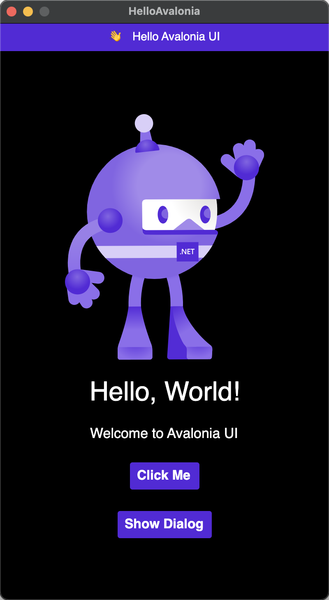

# Hello Avalonia

> Inspired by [Dependency Injection with Avalonia UI Apps](https://khalidabuhakmeh.com/dependency-injection-with-avalonia-ui-apps), I have add some featuse in this demo.

Todo List

- [x] upgrade releated packages to newest(fix breaking changes)
- [x] Lamar(Setter Injection)
- [x] CommunityToolkit.Mvvm(SourceGenerator)
- [x] DialogService
- [ ] NavigationService

that's all, enjoy yourself!

